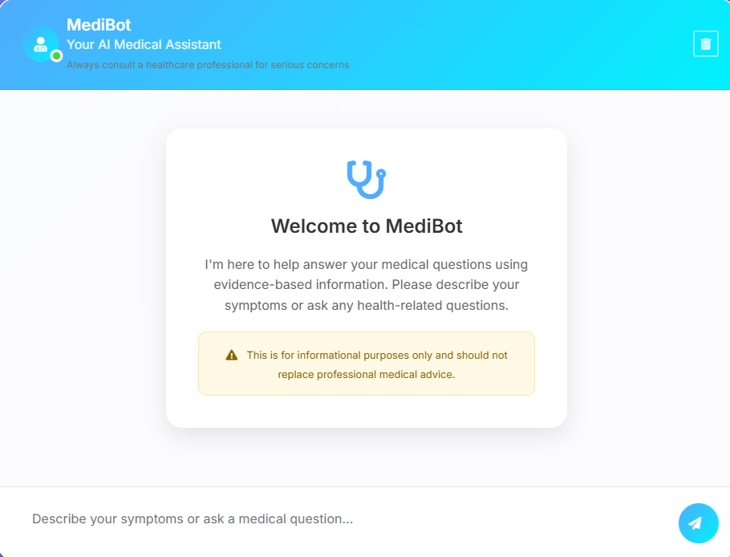

# Medical Chatbot with RAG

A sophisticated medical chatbot application powered by Retrieval-Augmented Generation (RAG) technology, providing intelligent, evidence-based medical assistance through advanced AI integration.



## Overview

This project implements a comprehensive medical chatbot system that combines modern web technologies with cutting-edge AI capabilities. The application leverages RAG architecture to provide contextually relevant medical information by retrieving data from a curated medical knowledge base and generating responses using state-of-the-art language models.


## Key Features

### Advanced AI Integration
- **Groq LLM Integration**: Utilizes Groq's high-performance Llama-3.1-8b-instant model for fast, accurate responses
- **RAG Architecture**: Implements Retrieval-Augmented Generation for evidence-based medical information
- **Pinecone Vector Database**: Efficient semantic search through medical literature
- **HuggingFace Embeddings**: Advanced text embeddings using sentence-transformers

### Intelligent Medical Assistance
- **Context-Aware Responses**: Maintains conversation history for coherent multi-turn interactions
- **Emergency Detection**: Automatically identifies potential medical emergencies
- **Safety Guidelines**: Provides appropriate medical disclaimers and professional consultation recommendations
- **Evidence-Based Information**: Responses grounded in medical literature and best practices

### Modern Web Interface
- **Responsive Design**: Optimized for desktop, tablet, and mobile devices
- **Real-Time Chat**: Instant messaging with smooth user experience
- **Professional UI**: Clean, medical-themed interface with intuitive navigation
- **Session Management**: Secure conversation handling with Flask sessions

## Technical Architecture

### Core Components
- **Backend**: Flask web framework with RESTful API design
- **AI Engine**: LangChain framework with custom RAG implementation
- **Vector Store**: Pinecone cloud-based vector database
- **Language Model**: Groq's Llama-3.1-8b-instant via API
- **Embeddings**: HuggingFace sentence-transformers/all-MiniLM-L6-v2
- **Frontend**: Modern HTML5/CSS3/JavaScript with Bootstrap 4

### Data Flow Architecture
1. **User Query Processing**: Input sanitization and preprocessing
2. **Emergency Detection**: Keyword-based critical situation identification
3. **Vector Retrieval**: Semantic search through medical knowledge base
4. **Context Augmentation**: Relevant document retrieval and ranking
5. **LLM Generation**: Contextual response generation with medical prompts
6. **Response Enhancement**: Safety disclaimers and professional recommendations
7. **Session Management**: Conversation history and state persistence

## Installation and Setup

### Prerequisites
- Python 3.8 or higher
- Pinecone account and API key
- Groq API key
- Git (for repository management)

### Environment Setup

1. **Clone the repository**
   ```bash
   git clone https://github.com/yourusername/Medical-Chatbot-rag.git
   cd Medical-Chatbot-rag
   ```

2. **Create virtual environment**
   ```bash
   python -m venv venv
   source venv/bin/activate  # On Windows: venv\Scripts\activate
   ```

3. **Install dependencies**
   ```bash
   pip install -r requirements.txt
   ```

4. **Configure environment variables**
   ```bash
   cp .env.example .env
   ```
   
   Update the `.env` file with your API credentials:
   ```env
   PINECONE_API_KEY=your_pinecone_api_key
   GROQ_API_KEY=your_groq_api_key
   SECRET_KEY=your_flask_secret_key
   PINECONE_INDEX_NAME=medical-chatbot
   MODEL_NAME=llama-3.1-8b-instant
   MAX_TOKENS=1000
   TEMPERATURE=0.3
   ```

5. **Initialize Pinecone vector database**
   ```bash
   python setup_pinecone.py
   ```

6. **Launch the application**
   ```bash
   python webapp.py
   ```

7. **Access the interface**
   Navigate to `http://localhost:8080` in your web browser

## Configuration Options

### Environment Variables
| Variable | Description | Required | Default |
|----------|-------------|----------|---------|
| `PINECONE_API_KEY` | Pinecone vector database API key | Yes | - |
| `GROQ_API_KEY` | Groq LLM API key | Yes | - |
| `SECRET_KEY` | Flask session encryption key | Yes | - |
| `PINECONE_INDEX_NAME` | Pinecone index identifier | No | medical-chatbot |
| `MODEL_NAME` | Groq model specification | No | llama-3.1-8b-instant |
| `MAX_TOKENS` | Maximum response length | No | 1000 |
| `TEMPERATURE` | Response creativity level | No | 0.3 |

### Model Configuration
The application supports multiple operational modes:
- **Full RAG Mode**: Complete integration with Pinecone and Groq LLM
- **Demo Mode**: Fallback mode with direct LLM interaction
- **Development Mode**: Enhanced debugging and logging capabilities

## Project Structure

```
Medical-Chatbot-rag/
├── webapp.py                 # Main Flask application
├── setup_pinecone.py        # Vector database initialization
├── requirements.txt         # Python dependencies
├── .env.example            # Environment template
├── .gitignore              # Git ignore rules
├── README.md               # Project documentation
├── PINECONE_SETUP_GUIDE.md # Pinecone configuration guide
├── src/
│   ├── __init__.py         # Package initialization
│   ├── helper.py           # Utility functions
│   ├── prompt.py           # Prompt templates
│   └── store_index.py      # Vector store operations
├── templates/
│   ├── index.html          # Landing page
│   └── chat.html           # Chat interface
├── static/
│   ├── style.css           # Application styles
│   └── .gitkeep           # Directory placeholder
├── data/
│   └── medical_book.pdf    # Medical knowledge base
├── images/
│   ├── front-page.PNG      # Interface screenshot
│   └── med rag bot.PNG     # Architecture diagram
└── notebooks/
    └── medical-chatbot-with-llama2.ipynb  # Development notebook
```

## API Endpoints

### Core Endpoints
- `GET /` - Main chat interface
- `POST /get` - Process user messages and return AI responses
- `POST /clear_history` - Clear conversation session
- `GET /health` - Application health status

### Response Format
```json
{
  "response": "AI-generated medical response",
  "timestamp": "2024-01-01T12:00:00Z",
  "session_id": "unique_session_identifier"
}
```

## Medical Safety Features

### Emergency Detection System
The application implements intelligent emergency detection for:
- Cardiovascular emergencies (chest pain, heart attack symptoms)
- Neurological emergencies (stroke indicators, severe headaches)
- Respiratory distress (breathing difficulties, severe asthma)
- Severe bleeding or trauma
- Allergic reactions and anaphylaxis
- Mental health crises

### Safety Protocols
- **Immediate Alerts**: Critical situation warnings with emergency contact recommendations
- **Professional Disclaimers**: Clear guidance to consult healthcare providers
- **Evidence-Based Responses**: Information sourced from medical literature
- **Liability Protection**: Appropriate legal disclaimers and usage guidelines

## Development and Deployment

### Local Development
```bash
export FLASK_ENV=development
python webapp.py
```

### Production Deployment
```bash
pip install gunicorn
gunicorn -w 4 -b 0.0.0.0:8080 webapp:app
```

### Docker Deployment
```dockerfile
FROM python:3.9-slim
WORKDIR /app
COPY requirements.txt .
RUN pip install -r requirements.txt
COPY . .
EXPOSE 8080
CMD ["python", "webapp.py"]
```

## Contributing

1. Fork the repository
2. Create a feature branch (`git checkout -b feature/enhancement`)
3. Commit your changes (`git commit -am 'Add new feature'`)
4. Push to the branch (`git push origin feature/enhancement`)
5. Create a Pull Request

## License

This project is licensed under the MIT License - see the [LICENSE](LICENSE) file for details.

## Disclaimer

**Important Medical Disclaimer**: This application is designed for educational and informational purposes only. It should never replace professional medical advice, diagnosis, or treatment. Always consult with qualified healthcare providers for medical concerns. For medical emergencies, immediately contact emergency services.

## Support

For technical support, bug reports, or feature requests:
- Create an issue in the GitHub repository
- Check the application health endpoint at `/health`
- Review the documentation and setup guides

---

**Version**: 2.0.0  
**Last Updated**: 2024  
**Maintainer**: Medical AI Development Team